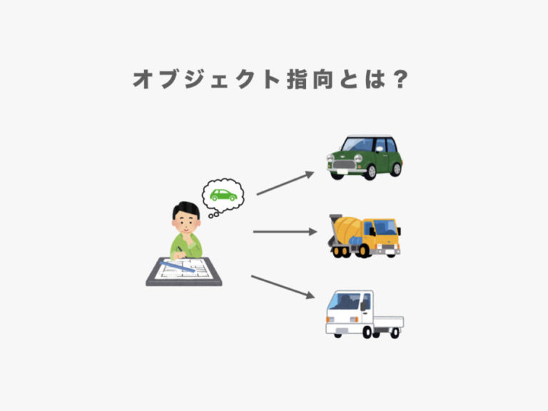

## オブジェクト指向について
### 初めに
- オブジェクト指向とは、プログラムを一つのオブジェクト（役割を持つもの）としてとらえクラスとして管理していくシステム構成方法のことを指します。
- オブジェクトとは、データの処理の集まりをまとめたもの
- クラスとは、オブジェクトを設計するための設計図のこと

### オブジェクト指向のメリットデメリット
- メリット
  - 複数の同じような処理をまとめて管理できる
  - 処理の追加や変更がしやすい
- デメリット
    - 書くときに時間がかかる
    - 再利用の時難易度が高い
    - 利用できる人が少なく難しい
### まとめ
- オブジェクト指向は、プログラムを一つのオブジェクトとしてとらえクラスとして管理していくシステム構成方法のことを指します。
- オブジェクト指向のメリットは、複数の同じような処理をまとめて管理できることや処理の追加や変更がしやすいことです。
- オブジェクト指向のデメリットは、書くときに時間がかかることや再利用の時難易度が高いこと、利用できる人が少なく難しいことです。
